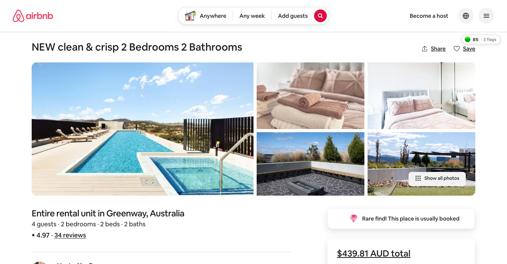

# Airbnb Red-Flag Detector

A Chrome extension that auto-analyzes Airbnb listings and surfaces concrete
concerns (cleanliness, safety, accuracy, host issues, hidden costs) **fully
on-device** using Chrome's built-in Gemini Nano via the Prompt API.

- **Auto-runs** on every `airbnb.com/rooms/<id>` page load
- **No backend, no API keys, no data leaves the browser**
- **90-day cache** keyed by listing ID — re-visits are instant
- **Floating badge** in the top-right of the listing page shows the trust
  score; click it to open the side panel for the full breakdown

## How it looks



When you open a listing, a small pill appears top-right:

```
🟢 85 · 3 flags
```

Bands: 🟢 75+ (probably fine) · 🟡 55–74 (read flags carefully) · 🔴 <55 (take seriously).

Click the pill → side panel opens with category scores, flagged review
quotes, and pattern warnings (templated reviews, repeated phrasing, etc.).

## Architecture

```
                   ┌────────────────────────────────────────┐
   listing page ──▶│ content.ts                              │
                   │  • fetch reviews via Airbnb GraphQL API │
                   │  • render floating badge                │
                   └──────┬───────────────────▲──────────────┘
                          │ reviews            │ result
                          ▼                    │
                   ┌──────────────────────┐    │
                   │ background.ts (SW)   │    │
                   │  • cache check       │────┘
                   │  • spawn offscreen   │
                   └──────┬───────────────┘
                          │
                          ▼
                   ┌──────────────────────┐
                   │ offscreen.html       │
                   │  • LanguageModel API │
                   │  • Nano analysis     │
                   └──────────────────────┘
                          │
                          ▼
                   ┌──────────────────────┐
                   │ chrome.storage.local │  ◀── side panel reads
                   │  90-day TTL          │
                   └──────────────────────┘
```

Why an offscreen document? The `LanguageModel` global isn't exposed in
service workers or content scripts. It's only available in extension pages
(side panel, popup, offscreen). The offscreen page is hidden, lives as long
as it's needed, and acts as the analyzer process.

## Layout

```
airbnb-redflag/
  README.md
  RUNBOOK.md
  .gitignore
  extension/
    manifest.json
    package.json
    tsconfig.json
    scripts/build.ts          bundles + copies assets to dist/
    src/
      content.ts              auto-runs on listing pages
      background.ts           service worker; orchestrates offscreen + cache
      airbnb-api.ts           StaysPdpReviewsQuery client (GraphQL)
      analyze.ts              chunks reviews, calls Nano, merges flags
      badge.ts                floating Shadow-DOM trust pill
      cache.ts                shared 90-day result cache
      ai-types.d.ts           minimal types for the Prompt API global
      types.ts                shared domain types
      offscreen/
        index.html
        offscreen.ts          LanguageModel host
      sidepanel/
        index.html
        sidepanel.ts          reads cache, renders breakdown
        sidepanel.css
```

## Requirements

- **Chrome 138+** (or Chromium with the Prompt API enabled)
- **Gemini Nano** available locally. Check via `chrome://on-device-internals`
  or by running `await LanguageModel.availability()` in DevTools — must
  return `"available"` or `"downloadable"`
- Hardware: ~22 GB free disk, 4 GB+ VRAM (Google's current requirement)
- Bun (for the build pipeline only — runtime is the browser)

If Nano is unavailable, the side panel shows a clear message pointing at
`chrome://flags/#prompt-api-for-gemini-nano`.

## Quick start

```bash
cd extension
bun install
bun run build           # outputs dist/
```

Then in Chrome: see `RUNBOOK.md` for the load-unpacked walkthrough.

## Tuning levers

- `analyze.ts` → `SYSTEM_PROMPT`: prompt engineering for false-positive rate
- `REVIEWS_PER_BATCH` (default 10): lower if Nano hits context limits
- `quoteAppearsInCorpus` (default 6-word window): hallucination filter
  strictness
- `computeTrustScore` / `computeCategoryScores`: severity penalty weights
- `CACHE_TTL_MS` (default 90 days)

## Known caveats

- **Persisted-query hash and API key are hardcoded** in `airbnb-api.ts`
  (last verified April 2026). When Airbnb rotates them, the API call returns
  400 with `error_type: "persisted_query_not_found"`. The extension catches
  this and falls back to DOM scraping.
- **DOM fallback is heuristic** — works on the current Airbnb markup but
  will need iteration when they ship UI changes.
- **Nano is a small model** (~3B params). It's reliable for extraction but
  sometimes paraphrases quotes; the substring-verification check in
  `analyze.ts:158` drops anything that doesn't match the source corpus.
- **First analysis is slow.** Fetching ~325 reviews takes ~10 s; analyzing
  takes 1–2 min on Nano. The 90-day cache means each listing pays this cost
  once.
- **Score is a triage signal, not a verdict.** Read the flag list, not just
  the number. See `RUNBOOK.md` for guidance.

## Next steps

- Inline the badge near the listing price block (currently floating
  top-right)
- "This flag is wrong" feedback button → local storage → drives prompt
  iteration
- Sniff persisted-query hash + API key from the page bundle so hardcoded
  defaults aren't load-bearing
